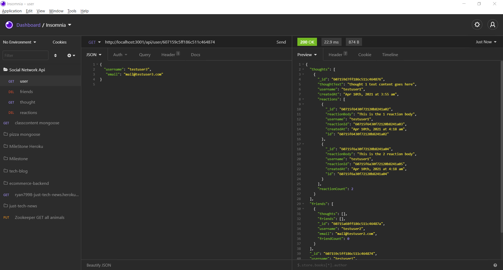

# social-network-api

## Screenshot:

## Description:
- This is a API for a social network that uses a NoSQL database SO THAT website can handle large amounts of unstructured data
- GIVEN a social network API
- WHEN user enters the command to invoke the application THEN the server is started and the Mongoose models are synced to the MongoDB database
- WHEN user opens API GET routes in Insomnia Core for users and thoughts THEN the data for each of these routes is displayed in a formatted JSON
- WHEN user tests API POST, PUT, and DELETE routes in Insomnia Core THEN he/she is able to successfully create, update, and delete users and thoughts in the database
- WHEN user test API POST and DELETE routes in Insomnia Core THEN user is able to successfully create and delete reactions to thoughts and add and remove friends to a user’s friend list.
- A virtual friendCount is created that retrieves the length of the user's friends array field on query.
- A virtual reactionCount is created that retrieves the length of the thought's reactions array field on query.
- Reaction Schema is created as the reaction field's subdocument schema in the Thought model.
- Removing a user, removes associated thoughts from thoughts collections.
- Creating a new thought push the created thought's _id to the associated user's thoughts array field.

## Technical description: 
- mongoDB (mongoose) and Sequelize is used.

## Walkthrough video:
